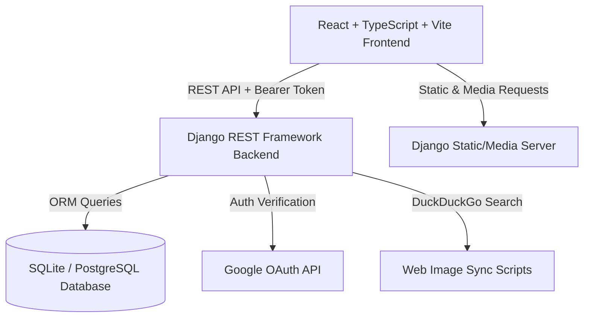

# Lexicon E-Commerce Platform Documentation

Welcome to the comprehensive technical documentation for **Lexicon**, a full-stack e-commerce web application.

---

## 📌 Executive Overview

Lexicon is a modern e-commerce platform built with a high-performance decoupled architecture:
- **Backend**: Built with Python & Django REST Framework (DRF), featuring JWT authentication, OAuth2 Google login, custom administrative management, automated media image search and synchronization, dynamic CSV bulk product upload, and PDF invoice generation.
- **Frontend**: Built with React 19, TypeScript, Vite, TailwindCSS (v4), Framer Motion / GSAP animations, Lucide React icons, and React Hook Form with Zod validation.

---

## 🏗 System Architecture



---

## 🚀 Quick Start & Setup Guide

### 1. Prerequisites
- **Python**: `3.10+`
- **Node.js**: `18+` / **npm**: `9+`

---

### 2. Backend Setup

1. **Navigate to backend directory**:
   ```bash
   cd Backend
   ```

2. **Create and activate a virtual environment**:
   - *Windows (PowerShell)*:
     ```powershell
     python -m venv venv
     .\venv\Scripts\Activate
     ```
   - *Linux / macOS*:
     ```bash
     python3 -m venv venv
     source venv/bin/activate
     ```

3. **Install dependencies**:
   ```bash
   pip install -r requirements.txt
   ```

4. **Environment Configuration**:
   Create a `.env` file inside the `Backend/` directory with the following variables:
   ```env
   SECRET_KEY=your-django-secret-key
   DEBUG=True
   ALLOWED_HOSTS=localhost,127.0.0.1
   DATABASE_URL=sqlite:///db.sqlite3
   CORS_ALLOWED_ORIGINS=http://localhost:5173
   GOOGLE_CLIENT_ID=your-google-client-id
   ```

5. **Run Migrations & Seed Data**:
   ```bash
   python manage.py migrate
   python manage.py createsuperuser
   ```

6. **Start Backend Development Server**:
   ```bash
   python manage.py runserver 8000
   ```
   The backend will be available at `http://127.0.0.1:8000/`.

---

### 3. Frontend Setup

1. **Navigate to frontend directory**:
   ```bash
   cd Frontend
   ```

2. **Install dependencies**:
   ```bash
   npm install
   ```

3. **Environment Configuration**:
   Create a `.env` file inside the `Frontend/` directory:
   ```env
   VITE_API_BASE_URL=http://localhost:8000/api
   VITE_GOOGLE_CLIENT_ID=your-google-client-id
   ```

4. **Start Frontend Development Server**:
   ```bash
   npm run dev
   ```
   The application will be served at `http://localhost:5173/`.

---

## 🛠 Key Features & Modules

### 1. Authentication & Security
- **JWT Authentication**: Refresh & Access token exchange mechanism.
- **Google OAuth**: Social login integrated with `@react-oauth/google` and DRF backend token generation.
- **Password Reset**: Automated token-based password reset flows.

### 2. Product & Inventory Management
- **Catalog Browsing**: Category filtering, keyword search, featured product carousels, and related product recommendations.
- **Bulk Upload**: Admin CSV product import (`/api/products/bulk-upload/`) with downloadable templates (`/api/products/csv-template/`).
- **AI / Image Sync**: Python utility scripts (`ai_image_search_and_sync.py`, `sync_product_images.py`, `cleanup_incorrect_images.py`) for automated product image scraping and linking.

### 3. Cart, Wishlist & Orders
- **Cart Management**: Dynamic quantity adjustment, item persistence, and single-click cart clearing.
- **Wishlist System**: User-specific product saved lists.
- **Checkout & Order System**: Multi-address management, order placement, order status lifecycle management, and PDF invoice generation via `reportlab`.

### 4. Admin Portal
- **Dashboard**: Customer metrics, order status updates (`AdminOrderUpdateStatusView`), customer directory view, and product updates.

---

## 🔌 API Endpoint Reference

| Category | HTTP Method | Path | Description |
| :--- | :--- | :--- | :--- |
| **Auth** | `POST` | `/api/auth/register/` | User registration |
| **Auth** | `POST` | `/api/auth/login/` | User login (returns JWT token) |
| **Auth** | `POST` | `/api/auth/google/` | Google OAuth login |
| **Auth** | `GET` | `/api/auth/me/` | Current user profile |
| **Auth** | `POST` | `/api/auth/token/refresh/` | Token refresh |
| **Products** | `GET` | `/api/products/` | Product list (with search & filters) |
| **Products** | `GET` | `/api/products/<slug>/` | Detailed product info |
| **Products** | `GET` | `/api/products/featured/` | Featured products |
| **Products** | `POST` | `/api/products/bulk-upload/` | Admin CSV bulk upload |
| **Cart** | `GET` / `POST` | `/api/cart/` | Fetch or add items to cart |
| **Cart** | `DELETE` | `/api/cart/<item_id>/` | Remove item from cart |
| **Cart** | `POST` | `/api/cart/clear/` | Empty cart |
| **Orders** | `POST` | `/api/orders/` | Place a new order |
| **Orders** | `GET` | `/api/orders/<order_number>/` | Fetch order details |
| **Orders** | `GET` | `/api/orders/<order_number>/invoice/` | Download PDF invoice |
| **Admin** | `GET` | `/api/admin/orders/` | List all orders (Admin) |
| **Admin** | `PATCH` | `/api/admin/orders/<id>/status/` | Update order status (Admin) |

---

## 📂 Directory Map

```
Lexicon/
├── Backend/                    # Django Application Root
│   ├── api/                    # API views, serializers, URLs & models
│   ├── lexicon_backend/        # Core settings & root WSGI/ASGI config
│   ├── media/                  # Uploaded & scraped product images
│   ├── ai_image_search_and_sync.py # Scraper & Sync script
│   └── requirements.txt        # Python dependency manifest
│
└── Frontend/                   # React 19 + Vite Application Root
    ├── src/
    │   ├── components/         # Reusable UI elements (Product, Cart, Nav)
    │   ├── layouts/            # Page wrapper layouts (Admin, User)
    │   ├── pages/              # View pages (Home, Shop, Checkout, Admin)
    │   ├── services/           # Axios API Client & Endpoints
    │   ├── types/              # TypeScript Type definitions
    │   └── App.tsx             # Main router & app initialization
    └── package.json            # Node.js dependencies & scripts
```

---

## 🧰 Available Scripts & Commands

### Backend Utility Scripts
- **Sync Product Images**:
  ```bash
  python Backend/sync_product_images.py
  ```
- **AI Image Search & Scrape**:
  ```bash
  python Backend/ai_image_search_and_sync.py
  ```

### Frontend NPM Scripts
- **Development Server**: `npm run dev`
- **Production Build**: `npm run build`
- **Linting**: `npm run lint`
- **Preview Build**: `npm run preview`
